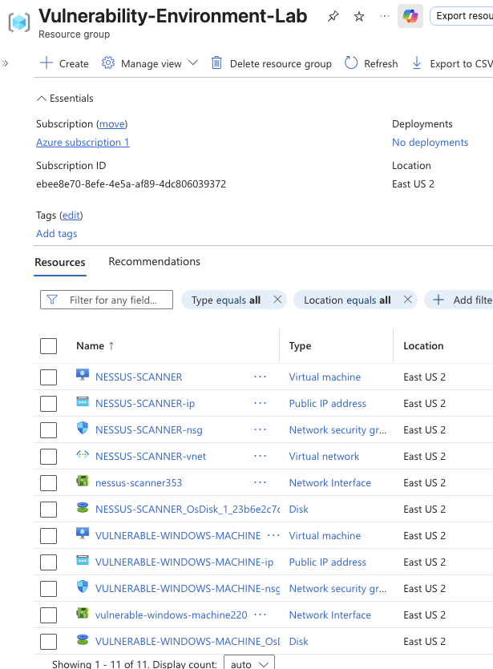
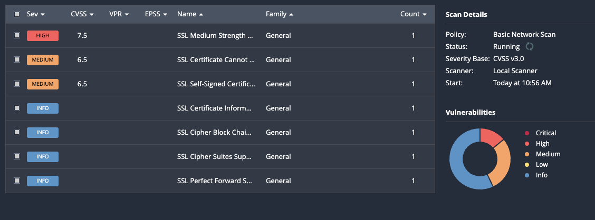
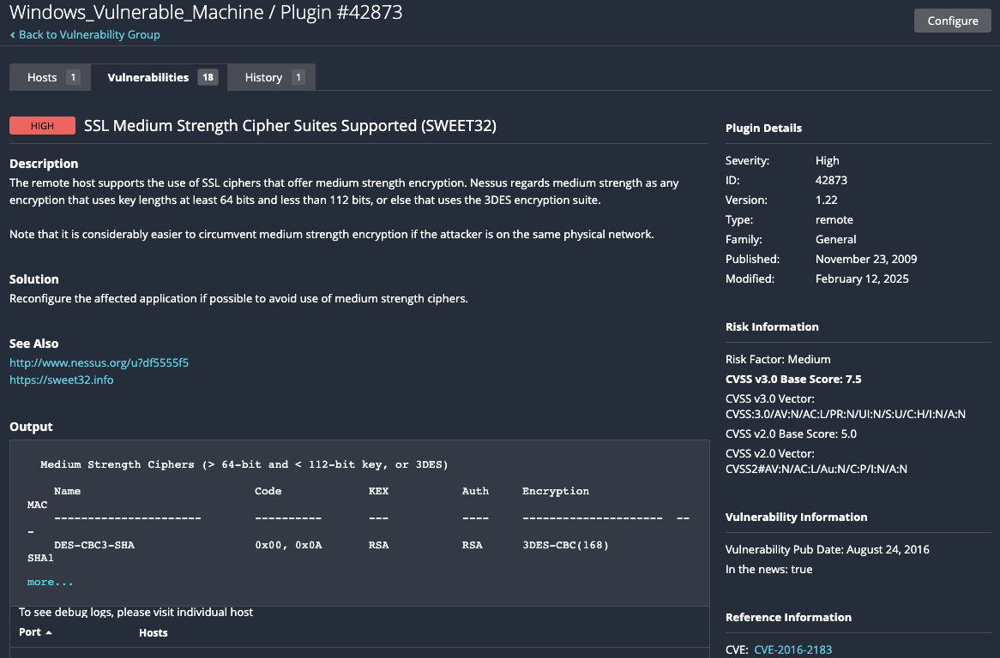
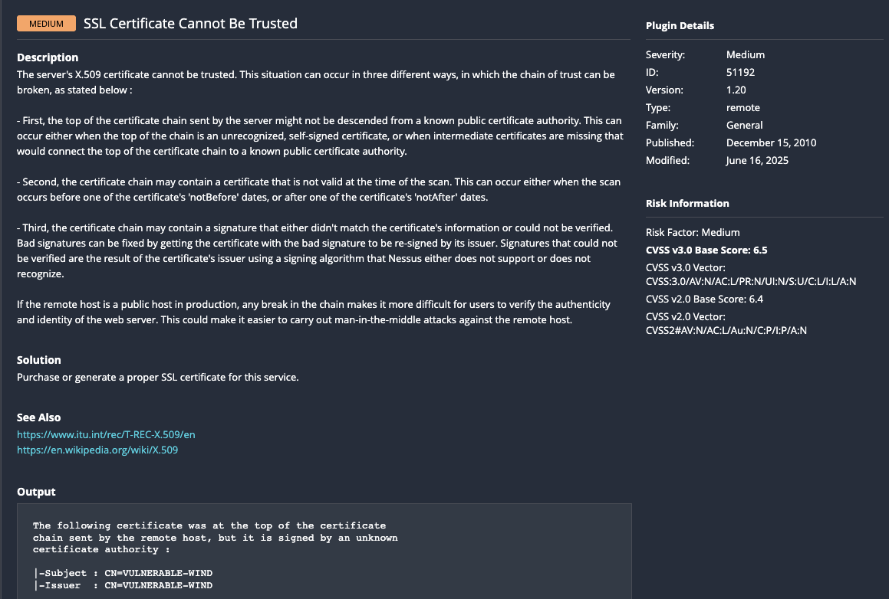

# Azure Vulnerability Management Lab: Scanning & CVSS Analysis

## Overview
This project replicates a vulnerability management workflow typical of a real security team. I built an isolated Azure environment containing intentionally vulnerable targets (Windows Server and Windows workstation VMs), then used a vulnerability scanner to identify, score, and analyze security weaknesses. The project involved two scanner implementations: an initial attempt with **OpenVAS (Greenbone Community Edition)**, which surfaced a long list of real-world deployment issues, and a second, successful implementation using **Tenable Nessus** after OpenVAS proved unreliable in this environment.

## Objectives
- Deploy vulnerable target VMs (Windows Server + Windows workstation) in an isolated Azure network
- Deploy and configure a vulnerability scanner (OpenVAS, then Nessus) to scan those targets
- Run vulnerability scans and interpret results using CVSS scoring
- Gain hands-on experience troubleshooting real infrastructure/networking issues in Azure
- Build practical familiarity with cloud networking and NSG configuration

## Skills Demonstrated
- Vulnerability scanning (OpenVAS / Nessus configuration and usage)
- Reading and interpreting CVSS scores to assess risk severity
- Azure cloud networking (VNets, NSGs, VM sizing/availability options)
- Linux system administration (Ubuntu, Docker, systemd services)
- Troubleshooting and root-cause analysis of infrastructure failures
- Disk/storage management in Azure (ephemeral vs. persistent storage, disk resizing)

## Architecture

| Component | Details |
| :--- | :--- |
| Resource Group | Vulnerability-Management-Lab-1 |
| Region | East US 2 |
| Scanner (Attempt 1) | OpenVAS / Greenbone Community Edition — Ubuntu 24.04 LTS VM |
| Scanner (Final) | Nessus — Ubuntu 22.04 LTS VM, Standard_D2as_v6 |
| Vulnerable Target 1 | Windows Server 2019 Datacenter |
| Vulnerable Target 2 | Windows workstation VM |



**Traffic Flow:**
Scanner VM (Nessus/OpenVAS) → Azure Virtual Network → Vulnerable Target VM(s) → Scan Results → CVSS-based Vulnerability Analysis

---

## Attempt 1: OpenVAS (Greenbone Community Edition)

### Setup
Created a resource group as an isolated container for all lab resources, then deployed an Ubuntu VM to host the scanner (no pre-built OpenVAS marketplace image was available/reliable, so it was installed manually).

**Ubuntu Scanner VM:**

| Property | Value |
| :--- | :--- |
| VM Name | Ubuntu-VM-Scanner-Vulnerability-Management-Lab-1 |
| Image | Ubuntu 24.04 LTS, Regular Server x64 Gen1 |
| Size | Standard_D2s_v3 (2 vCPUs, 8 GiB RAM) |
| Availability | No infrastructure redundancy required |

NSG was configured to restrict SSH to my public IP only, with ICMPv4 allowed temporarily for connectivity testing.

### Installation Attempts
First attempted a manual GVM (Greenbone Vulnerability Management) install:

```shell
sudo apt update && sudo apt upgrade -y
sudo apt -y install postgresql
sudo add-apt-repository ppa:mrazavi/gvm
sudo apt -y install gvm
sudo mkdir /var/lib/notus
sudo chown gvm:gvm /var/lib/notus
sudo -u gvm -g gvm greenbone-nvt-sync
```

This did not work reliably, so I switched to the `openvas` apt package with gvm-setup tooling:

```shell
sudo apt update && sudo apt upgrade -y
sudo apt install -y openvas
sudo gvm-setup
sudo gvm-check-setup
sudo gvm-start
```

After further issues getting the web GUI to bind externally, I moved to the **officially recommended Docker-based install** (Greenbone Community Edition via Docker Compose):

```shell
sudo apt install -y docker.io docker-compose
mkdir ~/greenbone && cd ~/greenbone
curl -f -O -L https://greenbone.github.io/docs/latest/_static/compose.yaml
sudo docker-compose -f docker-compose.yml -p greenbone-community-edition pull
```

This required upgrading from Docker Compose V1 to the V2 plugin (V1 could not parse the compose file):

```shell
sudo apt-get remove docker-compose -y
sudo apt-get update
sudo apt-get install -y ca-certificates curl gnupg
sudo install -m 0755 -d /etc/apt/keyrings
curl -fsSL https://download.docker.com/linux/ubuntu/gpg | sudo gpg --dearmor -o /etc/apt/keyrings/docker.gpg
sudo chmod a+r /etc/apt/keyrings/docker.gpg
echo "deb [arch=$(dpkg --print-architecture) signed-by=/etc/apt/keyrings/docker.gpg] https://download.docker.com/linux/ubuntu $(. /etc/os-release && echo "$VERSION_CODENAME") stable" | sudo tee /etc/apt/sources.list.d/docker.list > /dev/null
sudo apt-get update
sudo apt-get install -y docker-compose-plugin

sudo docker compose -f ~/greenbone/compose.yaml -p greenbone-community-edition pull
sudo docker compose -f ~/greenbone/compose.yaml -p greenbone-community-edition up -d
```

Ran into a disk-full error mid-pull (root disk at 100% of 29GB) and had to relocate Docker's data directory and later resize the OS disk to 64GB:

```shell
sudo systemctl stop docker
sudo mkdir -p /mnt/docker
sudo mv /var/lib/docker /mnt/docker
sudo ln -s /mnt/docker/docker /var/lib/docker
sudo systemctl start docker
```

This fix broke after a VM reboot, since Azure's `/mnt` drive is **ephemeral and wiped on restart** — this took down the Docker symlink entirely. The real fix was resizing the OS disk in Azure (30GB → 64GB) and rebuilding Docker's data directory on the persistent root disk:

```shell
sudo growpart /dev/sda 1
sudo resize2fs /dev/root
df -h
```

### Issues Encountered & Resolutions

| # | Issue | Cause | Solution |
| :-: | :--- | :--- | :--- |
| 1 | No VM sizes available for Gen1 image | Azure region lacked Gen1 inventory | Selected "No infrastructure redundancy required" to unlock D2s_v3 size |
| 2 | Could not SSH into VM / ping not working | NSG had no inbound rule for SSH (port 22) or ICMP | Added inbound NSG rules: Allow SSH (port 22) and Allow ICMP from local IP |
| 3 | OpenVAS web GUI showing "URL not found" | GSA frontend package not included in apt install | Switched to Greenbone Community Edition via Docker (official recommended method) |
| 4 | `gsad` only listening on 127.0.0.1 (localhost) | Service file hardcoded listen address to localhost | Edited `/lib/systemd/system/gsad.service` `ExecStart` to use `--listen=0.0.0.0 --port=9392` |
| 5 | `docker-compose.yml` URL returned 404 | Greenbone docs URL structure had changed | Used correct URL: `https://greenbone.github.io/docs/latest/_static/compose.yaml` |
| 6 | Docker Compose V1 incompatible with compose.yaml | `name` field and boolean env vars not supported in V1 | Installed `docker-compose-plugin` (V2) via official Docker apt repository |
| 7 | No space left on device during Docker pull | Root disk was 100% full (29GB) from GVM apt packages | Moved Docker data dir to `/mnt` (temp fix), then resized OS disk to 64GB in Azure Portal |
| 8 | Docker failed to start after VM reboot | `/mnt` drive in Azure is ephemeral and wiped on reboot, breaking Docker symlink | Removed broken symlink, recreated `/var/lib/docker` on root disk, resized disk to 64GB |
| 9 | nginx container binding to 127.0.0.1 only | `compose.yaml` had ports set to `127.0.0.1:443` and `127.0.0.1:9392` | Edited `compose.yaml` to bind ports to `0.0.0.0:443` and `0.0.0.0:9392` |
| 10 | nginx/gsad/gvmd containers stuck in "Created" state | Dependency chain stalled waiting for other containers | Ran `docker compose restart gvmd gsad nginx` — containers started successfully |
| 11 | Web GUI still inaccessible after containers running | Port 443 not open in Azure NSG | Added inbound NSG rule: Allow HTTPS (port 443) from local IP |

**Key takeaways from this attempt:**
- Azure's `/mnt` drive is ephemeral - never use it for persistent data (Docker, databases, etc.)
- Always set a VM's public IP to Static to avoid IP changes on reboot
- Run `sudo systemctl enable docker` to auto-start Docker on boot
- Greenbone Community Edition via Docker is the officially recommended install method - the manual `apt`-based install path is far less reliable

Despite eventually getting containers running, continued instability with the Greenbone Docker stack led me to try a different scanner for the final build.

---

## Attempt 2 (Final): Nessus

### Nessus Scanner VM

| Property | Value |
| :--- | :--- |
| VM Name | NESSUS-SCANNER |
| Region | East US 2 |
| Security Type | Trusted Launch Virtual Machine |
| Image | Ubuntu Server 22.04 LTS, x64 Gen2 |
| Size | Standard_D2as_v6 (2 vCPUs, 8 GiB RAM) |
| Availability | No infrastructure redundancy required |

**NSG Rules:**
- TCP/22 (SSH) - restricted to my IP only
- TCP/8834 (Nessus Web UI) - allowed for scanner access

### Installing Nessus

```shell
curl --request GET \
  --url 'https://www.tenable.com/downloads/api/v2/pages/nessus/files/Nessus-10.12.0-ubuntu1604_amd64.deb' \
  --output 'Nessus-10.12.0-ubuntu1604_amd64.deb'

sudo dpkg -i Nessus-10.12.0-ubuntu1604_amd64.deb
sudo /bin/systemctl start nessusd.service
```

Accessed the Nessus web UI securely via an SSH tunnel rather than exposing port 8834 directly:

```shell
ssh -L 8834:localhost:8834 <username>@<ubuntu-public-ip>
```

Then browsed to `https://localhost:8834` locally.

Checked service status as needed:

```shell
sudo systemctl status nessusd
```

### Vulnerable Target: Windows Server

| Property | Value |
| :--- | :--- |
| VM Name | VULNERABLE-WINDOWS-MACHINE |
| Region | East US 2 |
| Security Type | Trusted Launch Virtual Machine |
| Image | Windows Server 2019 Datacenter, x64 Gen2 |
| Size | Standard_DC1ds_v3 (1 vCPU, 8 GiB RAM) |

**NSG Rules:**
- TCP/3389 (RDP) — restricted to my IP only
- ICMP — allowed from the Nessus scanner (for connectivity testing)
- All traffic — allowed from the Nessus scanner IP (required for full scan coverage)

Disabled the Windows Firewall (Domain, Private, and Public profiles) via `wf.msc` → Firewall Properties, matching the process used in the honeypot project, so the vulnerability scanner could reach all relevant services on the target.

### Running the Scan
With Nessus running and both target VMs reachable across the NSG rules, a vulnerability scan was configured against the target IP(s) and executed from the Nessus web UI.



## Findings / Results
- Total vulnerabilities found exceeds the amount that was predicted, which should've been expected
  for a older version of the VM running
- Each vulnerability found is broken down by CVSS severity (Critical / High / Medium / Low)
- Most significant CVE(s) found are highly exploitable entry points for attackers to leverage when
  attacking the target
- Any findings that would be prioritized for remediation in a real environment




## Lessons Learned / Next Steps
- OpenVAS/Greenbone via Docker is powerful but fragile in a minimal-disk cloud VM setup - plan disk sizing up front rather than resizing mid-install
- Always account for Azure's ephemeral `/mnt` drive when installing anything stateful
- Nessus proved more straightforward to deploy reliably in this environment for the purposes of this lab
- Future iterations: automate scan scheduling, export and track CVSS trends over multiple scans, and map findings to remediation recommendations

---
*Note: This lab was conducted in an isolated Azure environment for educational purposes. Scanner-to-target communication was scoped only to the lab's private network and my own IP address. Any credentials used during setup have been changed/rotated and are not reflected in this document.*
